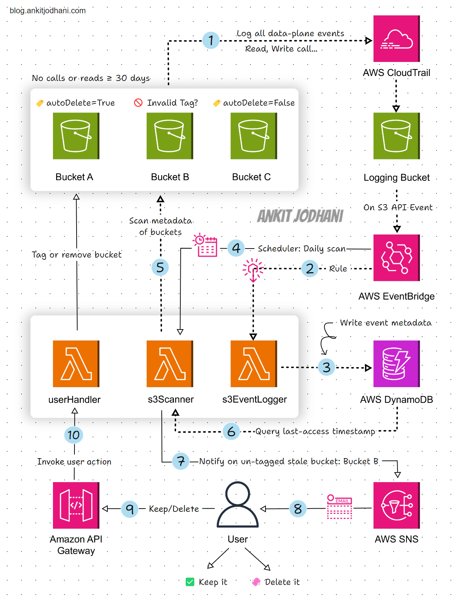

# 📦 AWS S3 Cost Optimization

An automated, event-driven solution to identify and clean up abandoned S3 buckets, helping you optimize AWS costs with minimal human intervention.

## 🌟 Overview

Have you ever created numerous S3 buckets for testing and development that eventually got abandoned? This project provides an automated solution that:

- Identifies buckets that haven't been accessed in 30+ days
- Uses simple tagging (`autoDelete=True|False`) to determine cleanup actions
- Notifies users about untagged abandoned buckets
- Provides one-click options to keep or delete buckets
- Runs completely serverless with zero maintenance

## 🏗️ Architecture

### Workflow Explanation

1. **CloudTrail** keeps track of all bucket read/write calls
2. **EventBridge Rule** captures S3 events and triggers the S3EventLogger Lambda
3. **S3EventLogger** stores bucket activity data in DynamoDB
4. **EventBridge Scheduler** triggers s3Scanner Lambda daily at 9:00 AM
5. **s3Scanner** examines buckets that haven't been accessed in 30+ days and:
   - Deletes buckets tagged `autoDelete=True`
   - Skips buckets tagged `autoDelete=False`
   - For untagged buckets, notifies users via SNS
6. **SNS** sends emails to users with action links
7. **API Gateway** receives user decisions
8. **UserResponseHandler** Lambda either adds preservation tags or deletes buckets

## 📋 Prerequisites

- AWS Account with administrative privileges
- Basic knowledge of Python and Boto3
- Understanding of AWS Lambda, EventBridge, DynamoDB, API Gateway, SNS

## 📦 AWS Services Used

- 🪣 **Amazon S3** - The target service being optimized
- ⛅ **CloudTrail** - Tracks bucket activity
- 🔄 **EventBridge** - Manages event rules and scheduling
- 🖥️ **Lambda** - Runs the serverless functions
- 🚀 **DynamoDB** - Stores bucket access data
- 📨 **SNS** - Sends notifications to users
- 🌏 **API Gateway** - Provides user response endpoints

## 🛠️ Implementation Guide

### Step 1: Set Up CloudTrail for Bucket Activity Tracking

Configure CloudTrail to log data events for S3 buckets:
- Create a dedicated S3 bucket for CloudTrail logs (e.g., `s3EventLoggingStorage`)
- Set up a trail that captures data-level events for S3 operations

### Step 2: Create DynamoDB Table

Create a table named `s3DateLogger` with the following schema:
- Partition Key: `BucketName` (String)
- Additional attributes: EventDate, EventTime, EventName, Status

### Step 3: Deploy Lambda Functions

This repository contains three Lambda functions:

1. **S3EventLogger.py** - Records bucket activity from CloudTrail events
2. **s3Scanner.py** - Analyzes bucket access patterns and takes action based on tags
3. **UserResponseHandler.py** - Processes user decisions for untagged buckets

### Step 4: Configure EventBridge

Set up two EventBridge components:
- A rule that captures S3 events and triggers S3EventLogger
- A scheduler that runs s3Scanner daily at 9:00 AM

### Step 5: Set Up SNS and API Gateway

- Create an SNS topic with email subscriptions for notifications
- Configure API Gateway endpoints to handle user decisions

## ⚠️ Limitations & Notes

- This was developed as a weekend project and can be further improved
- Additional error handling may be needed for production environments
- Consider implementing more sophisticated bucket ownership detection
- The solution incurs small costs for CloudTrail data events

## 📚 Learn More

For a detailed explanation of this project, read my blog post:
[AWS S3 Cost Optimization: Automate Cleanup of Abandoned Buckets](https://blog.ankitjodhani.com/aws-s3-cost-optimization-automate-cleanup-of-abandoned-buckets/)

## 👋 Connect With Me

- LinkedIn: [Ankit Jodhani](https://www.linkedin.com/in/ankit-jodhani/)
- Twitter/X: [@ankitjodhani19](https://x.com/Ankit__Jodhani)
- Email: ankitjodhani1903@gmail.com
- Blog: [blog.ankitjodhani.com](https://blog.ankitjodhani.com)

---

If you find this project helpful, please leave a ⭐ on this repo!

Made with ❤️ by Ankit Jodhani
